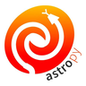
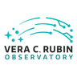

 

 

---

## `$ whoami`

  🔭 Licenciado en Física, mención Astronomía (PUCV) 
  📊 Pivotando a ciencia de datos 
  🌌 Experiencia en datos astronómicos: Rubin/LSST, ZTF y ALeRCE 
  🤖 Me interesa el machine learning aplicado a datos científicos 
  🤝 Abierto a colaboraciones de investigación y proyectos freelance 

 

## `$ cat tech-stack.yaml`

<table border="1" cellpadding="14" bgcolor="#17171c">
  <thead>
    <tr>
      <th colspan="2" align="left"><code>pablo:~$ cat tech-stack.yaml</code></th>
    </tr>
  </thead>
  <tbody>
    <tr>
      <td width="50%" valign="top"><code>├─ 🐍 data_science:</code>  
        
         
        <code>Python · Pandas</code>
      </td>
      <td width="50%" valign="top"><code>├─ 🤖 machine_learning:</code>  
         
        <code>Scikit-learn · TensorFlow · PyTorch</code>
      </td>
    </tr>
    <tr>
      <td valign="top"><code>├─ 🔭 astronomy:</code>  
        
        
        
         
        <code>Astropy · Rubin/LSST · ZTF · ALeRCE </code>
      </td>
      <td valign="top"><code>╰─ ⚙ tools:</code>  
         
        <code>Git · GitHub · MATLAB</code>
      </td>
    </tr>
  </tbody>
  <tfoot>
    <tr>
      <td colspan="2"><code>status: ready&nbsp;&nbsp;·&nbsp;&nbsp;open_to: research + freelance</code></td>
    </tr>
  </tfoot>

</table>

---

## `$ cat learning.log`

  <code>📚 IBM Data Science Professional Certificate</code> 
  <code>🧠 Machine Learning Specialization (DeepLearning.AI)</code> 
  <code>🗄️ SQL y plataformas cloud</code>

---

## `$ ls projects/`

  <code>🚧 En construcción, próximamente nuevos proyectos.</code>

---

<!-- SOCIALS -->
## `$ connect --socials`

&nbsp;&nbsp;
&nbsp;&nbsp;

 
 

